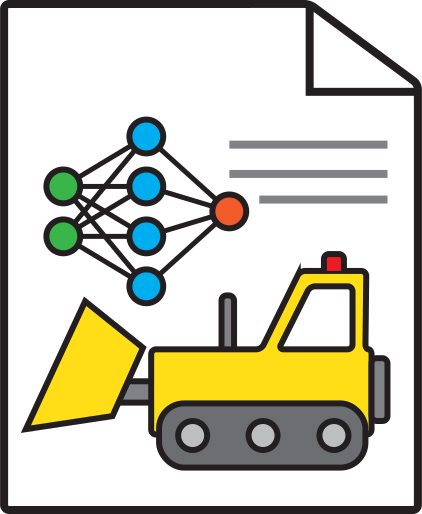

# cv-gfx-ml-icons

This repository contains a set of CC0 icons in `.svg` format to be used for research talks, paper diagrams, videos, or whatever you want to use it for. The icons are mostly themed around computer vision, computer graphics, and machine learning.

I've always been frustrated by how annoying it is to find copyright-free icons and found myself making the same figures over and over so I thought I would keep a repository of them.

These icons are released under the [CC0 1.0 Universal (CC0 1.0) Public Domain Dedication](https://creativecommons.org/publicdomain/zero/1.0/) which means you can use these icons for anything without permission or acknowledgement. Acknowledgement of course would always be appreciated though!

If you have any requests, if you file an issue I may create an icon for it someday.

## Current Catalog

| Name | Image | Link | 
|------------|-------|---------------|
| Neural Network |  | [.svg](neuralnetwork.svg) |
| Bulldozer |  | [.svg](bulldozer.svg) |
| Bunny |  | [.svg](bunny.svg) |
| Neural Field Paper |  | [.svg](neuralfieldpaper.svg) |
| Floppy Disk |  | [.svg](floppydisk.svg) |
| Deep Neural Network |  | [.svg](deepneuralnetwork.svg) |
| Side Eye |  | [.svg](sideeye.svg) |
